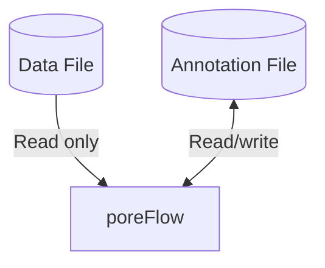

# Annotations

## Overview

PoreFlow separates original measurement data from analysis results using an annotation system. This has two main advantages:

1. The integrity of the original data is preserved
2. This enables more flexible and efficient analysis

A schematic of the system is shown below. The **data file**  is the original data created on the measurement device 
(ONT/UTube), this file contains the raw current and voltage data. poreFlow will only read from this file to preserve 
its integrity.

On the other hand, the **annotation file** is used by poreFlow to both store and 
retrieve data. This file contains information like events, steps, open state current fits, and more.




## Usage

Interfacing between the data and annotation files is done automatically by [`poreflow.File`][F]. In the section below, 
you can find usage examples outlining how this works.

### Opening a data file for the first time


When a data file is opened for the first time, poreFlow will automatically create an annotation file in which to store 
analysis results. Consider this simple project structure:

=== ":lucide-flask-conical: UTube"
    ```title="Project structure"
    my-project/
     └── measurement.dat 
    ```

    Then this `.dat` data file, can be opened using [`poreflow.File`][F]:

    ```python linenums="1"
    import poreflow as pf
    
    with pf.File("measurement.dat") as f: # (1)!
        f.find_events() # (2)!
    ```

    1.  A `.fast5` and annotation file is created automatically here.
    2.  Analysis results, such as events, are automatically stored in the annotations file.

=== ":lucide-building-2: ONT"
    ```title="Project structure"
    my-project/
     └── measurement.fast5 
    ```

    Then this `.fast5` data file, can be opened using [`poreflow.File`][F]:

    ```python linenums="1"
    import poreflow as pf
    
    with pf.File("measurement.fast5") as f: # (1)!
        f.find_events() # (2)!
    ```

    1.  An annotation file is created automatically here.
    2.  Analysis results, such as events, are automatically stored in the annotations file.

In the background, poreFlow automatically creates an annotation file. By default, this file is placed in the same 
directory as the data file, and the file has the same name as the annotation file, but with the extension 
`.annot.fast5`, in this case: `measurement.annot.fast5`. 

=== ":lucide-flask-conical: UTube"
    ```title="Project structure (after opening)"
    my-project/
     ├── measurement.dat    
     ├── measurement.fast5    
     └── measurement.annot.fast5  <-- Analysis results (read-write)
    ```

=== ":lucide-building-2: ONT"
    ```title="Project structure (after opening)"
    my-project/
     ├── measurement.fast5    
     └── measurement.annot.fast5  <-- Analysis results (read-write)
    ```

All analysis results are automatically saved to this file. 

### Opening an annotated file

!!! info
    For simplicity, further examples on this page use the ONT `.fast5` file as an example, but work just as well with UTube `.dat` files

If an annotation file already exists next to the data file, it's automatically loaded. Consider this example, 
where we continue analyzing the file from the [previous section](#opening-an-unannotated-data-file), in which we 
already ran event detection.

```title="Project structure"
my-project/
 ├── measurement.fast5    
 └── measurement.annot.fast5 
```

```python linenums="5"
with pf.File("measurement.fast5") as f:
    print(f.has_events)
   
    df = f.events  # (1)!
```

1. Event data is loaded from annotation file. Note that in this example, f.get_events would also work as well.


### Storing annotations in a different directory

Annotations can also be automatically created and read from in a separate directory. [HDF5 File]
To do so, specify the `annotation_path` argument in [`poreflow.File`][F]. 

```title="Project structure"
my-project/
 ├── measurement.fast5
 └── analysis/
     └── annotations/
         └── measurement.annot.fast5
```

```python linenums="9"
annotations_dir = "analysis/annotations"

with pf.File("measurement.fast5", annotation_path=annotations_dir) as f:
    df = f.events
```


### Opening via an annotation file

You can also open a data file by requesting using its annotation in [`poreflow.File`][F]. The annotation 
stores its parent data file inside, allowing the file loader to automatically find and load the data file.

```title="Project structure"
my-project/
 ├── measurement.fast5    
 └── measurement.annot.fast5
```

```python
import poreflow as pf

# Open using the annotation file
with pf.File("measurement.annot.fast5") as f: # (1)!
    events = f.get_events() 
```

1. The linked measurement.fast5 is automatically loaded here

!!! tip
    Both the `fast5` and `annot.fast5` files must be in the same directory.


### Multiple annotations

A powerful feature of the annotation system is the ability to analyze the same raw data in different ways, 
each with its own annotation file. Consider a simple project:

```title="Project structure"
my-project/
 └── measurement.fast5
```

Imagine we want to try to analyse this measurement using two different approaches. This can be managed easily 
using the annotation system by creating a unique annotation file per analysis:

=== ":lucide-folder: Storing annotations in different directories"

    In this example we process the measurement twice, storing the annotation in a different folder for each.

    ```python linenums="1"
    import poreflow as pf
    
    # Analysis 1: Default parameters
    with pf.File("measurement.fast5", search_path="default") as f:
        f.find_events(min_duration=0.1)
        print(f.n_events)
    
    # Analysis 2: Long events only 
    with pf.File("measurement.fast5", search_path="long") as f:
        f.find_events(min_duration=1)
        print(f.n_events)
    ```
    
    This approach results in the following project structure:

    ```title="Project structure"

    project/
     ├── measurement.fast5                 
     ├── default/
     │   └── measurement.annot.fast5      # Default process
     └── long/
         └── measurement.annot.fast5      # Alternative process
    ```

    ??? info "Why `search_path`?"
        The `search_path` parameter in [`poreflow.File`][F] specifies where to search for an annotation, and to create 
        an annotation in this folder if none is found. That is why this parameter is used for saving and loading 
        multiple annotations stored in different folders.

    ??? example "Storing configurations alongside annotations"
        Storing annotations in different folders could be particularly useful when also storing the configurations
        (such as poreflow.toml) used for processing alongside the annotations. For example: 

        ```title="Example project structure"

        project/
         ├── measurement.fast5                 
         ├── default/
         │   ├── poreflow.toml                # Default configuration
         │   └── measurement.annot.fast5      # Default process
         └── long/
             ├── poreflow.toml                # Alternative configuration
             └── measurement.annot.fast5      # Alternative process
        ```

=== ":lucide-file: Storing annotations with different filenames"

    In this example we process the measurement twice, storing the annotations with different filenames.

    ```python linenums="1"
    import poreflow as pf
    
    # Analysis 1: Default parameters
    with pf.File("measurement.fast5", annotation_name="default") as f:
        f.find_events(min_duration=0.1)
        print(f.n_events)
    
    # Analysis 2: Long events only 
    with pf.File("measurement.fast5", annotation_name="long") as f:
        f.find_events(min_duration=1)
        print(f.n_events)
    ```
    
    This approach results in the following project structure:

    ```title="Project structure"

    project/
     ├── measurement.fast5                 
     ├── default.annot.fast5    # Default parameters
     └── long.annot.fast5       # Alternative parameters 
    ```
    

## What's Stored Where

Which objects are stored in which file is summarized in the table below.

| Data Type | Location | File Extension | Access Mode |
|----------|----------|----------------|-------------|
| Raw current/voltage | Original file | `.fast5` or `.dat` | Read-only |
| Sampling rate | Original file | `.fast5` or `.dat` | Read-only |
| Events   | Annotation file | `.annot.fast5` | Read-write |
| Steps    | Annotation file | `.annot.fast5` | Read-write |
| Open state fits | Annotation file | `.annot.fast5` | Read-write |


## Best Practices

Some general tips on how to use annotations:

1. **Version Control**: While raw `.fast5` files are generally too large to store in version control (Git), 
`.annot.fast5` are much smaller and could be stored in Git.

2. **Backup Strategy**: While raw data files are precious and should be backed up regularly, annotation files can be 
regenerated from raw data if their (if the configuration of analysis steps is known). This means that annotation files 
can be more readily deleted.

3. **Collaboration**: A corollary of the above: While raw data files are shared on the drive, it makes sense to 
have annotation files on your device only.

[HDF5 File]: https://support.hdfgroup.org/documentation/hdf5/latest/_h5_d_m__u_g.html
[F]: ../../reference/poreflow/#poreflow.File