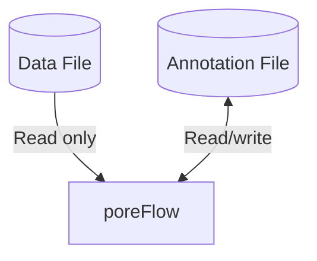

# Annotations

## Overview

PoreFlow separates original measurement data from analysis results using an annotation system. This has two main advantages:

1. The integrity of the original data is preserved
2. This enables more flexible and efficient analysis

A schematic of the system is shown below. The **data file**  is the original data created on the measurement device 
(ONT/UTube), this file contains the raw current and voltage data. poreFlow will only read from this file to preserve 
its integrity.

On the other hand, the **annotation file** is used by poreFlow to both store and 
retrieve data. This file contains information like events, steps, open state current fits, and more.




## Usage

Interfacing between the data and annotation files is done automatically by [`poreflow.File`][F]. In the section below, 
you can find usage examples outlining how this works.

### Opening an unannotated data file


When an unannotated data file is opened, poreFlow will automatically create an annotation file in which to store 
analysis results.
Consider this simple project structure:

```title="Project structure"
my-project/
 └── measurement.fast5 
```

Then this `.fast5` or `.dat` data file, can be opened using [`poreflow.File`][F]:

```python linenums="1"
import poreflow as pf

with pf.File("measurement.fast5") as f: # (1)!
    f.find_events() # (2)!
```

1.  An annotation file is created automatically here.
2.  Analysis results, such as events, are automatically stored in the annotations file.

In the background, poreFlow automatically creates an annotation file. By default, this file is placed in the same 
directory as the data file, and the file has the same name as the annotation file, but with the extension 
`.annot.fast5`, in this case: `measurement.annot.fast5`. 

```title="Project structure (after opening)"
my-project/
 ├── measurement.fast5    
 └── measurement.annot.fast5  <-- Analysis results (read-write)
```


All analysis results are automatically saved to this file. 

### Opening an annotated file

If an annotation file already exists next to the data file, it's automatically loaded. Consider this example, 
where we continue analyzing the file from the [previous section](#opening-an-unannotated-data-file), in which we 
already ran event detection.

```title="Project structure"
my-project/
 ├── measurement.fast5    
 └── measurement.annot.fast5 
```

```python linenums="5"
with pf.File("measurement.fast5") as f:
    print(f.has_events)
   
    df = f.events  # (1)!
```

1. Event data is loaded from annotation file. Note that in this example, f.get_events would also work as well.


### Storing annotations in a different directory

Annotations can also be automatically created and read from in a separate directory. [HDF5 File]
To do so, specify the `annotation_path` argument in [`poreflow.File`][F]. 

```title="Project structure"
my-project/
 ├── measurement.fast5
 └── analysis/
     └── annotations/
         └── measurement.annot.fast5
```

```python linenums="9"
annotations_dir = "analysis/annotations"

with pf.File("measurement.fast5", annotation_path=annotations_dir) as f:
    df = f.events
```


### Opening via an annotation file

You can also open a data file by requesting using its annotation in [`poreflow.File`][F]. The annotation 
stores its parent data file inside, allowing the file loader to automatically find and load the data file.

```title="Project structure"
my-project/
 ├── measurement.fast5    
 └── measurement.annot.fast5
```

```python
import poreflow as pf

# Open using the annotation file
with pf.File("measurement.annot.fast5") as f: # (1)!
    events = f.get_events() 
```

1. The linked measurement.fast5 is automatically loaded here

!!! tip
    Both the `fast5` and `annot.fast5` files must be in the same directory.


### Multiple annotations

A powerful feature of the annotation system is the ability to analyze the same raw data in different ways, each with its own annotation file:

```title="Project structure"
my-project/
 └── measurement.fast5
```

```python
import poreflow as pf
from pathlib import Path

# Original measurement file
measurement = "experiment_20240315.fast5"

# Create different analysis directories
analysis_dirs = {
    "default": Path("."),
    "conservative": Path("analysis/conservative"),
    "aggressive": Path("analysis/aggressive")
}

# Ensure directories exist
for dir_path in analysis_dirs.values():
    dir_path.mkdir(parents=True, exist_ok=True)

# Analysis 1: Default parameters
with pf.File(measurement, annotation_path=analysis_dirs["default"]) as f:
    events_default = pf.detect_events(f, channel=0)
    f.set_events(events_default)
    # Saved to: experiment_20240315.annot.fast5

# Analysis 2: Conservative parameters (higher thresholds)
with pf.File(measurement, annotation_path=analysis_dirs["conservative"]) as f:
    events_conservative = pf.detect_events(f, channel=0, 
                                          threshold=1.5,  # Higher threshold
                                          min_duration=0.002)  # Longer minimum duration
    f.set_events(events_conservative)
    # Saved to: analysis/conservative/experiment_20240315.annot.fast5

# Analysis 3: Aggressive parameters (lower thresholds)
with pf.File(measurement, annotation_path=analysis_dirs["aggressive"]) as f:
    events_aggressive = pf.detect_events(f, channel=0,
                                         threshold=0.8,  # Lower threshold
                                         min_duration=0.0005)  # Shorter minimum duration
    f.set_events(events_aggressive)
    # Saved to: analysis/aggressive/experiment_20240315.annot.fast5

# Folder structure:
# project/
# ├── experiment_20240315.fast5                  # Original raw data
# ├── experiment_20240315.annot.fast5             # Default analysis
# └── analysis/
#     ├── conservative/
#     │   └── experiment_20240315.annot.fast5      # Conservative parameters
#     └── aggressive/
#         └── experiment_20240315.annot.fast5      # Aggressive parameters
```


## What's Stored Where

Which objects are stored in which file is summarized in the table below.

| Data Type | Location | File Extension | Access Mode |
|----------|----------|----------------|-------------|
| Raw current/voltage | Original file | `.fast5` or `.dat` | Read-only |
| Sampling rate | Original file | `.fast5` or `.dat` | Read-only |
| Events   | Annotation file | `.annot.fast5` | Read-write |
| Steps    | Annotation file | `.annot.fast5` | Read-write |
| Open state fits | Annotation file | `.annot.fast5` | Read-write |


This approach allows you to:
- Compare different analysis strategies on the same data
- Optimize parameters without losing previous work
- Maintain a complete audit trail of your analysis process
- Easily switch between different interpretations of the same data

### Working with DataFile and Annotation Classes

For advanced users who need direct control:

```python
from poreflow.io.ont import DataFile
from poreflow.io.annotations import Annotation

# Open raw data only (no annotations)
datafile = DataFile("measurement.fast5")
raw_data = datafile.get_raw(channel=0)
datafile.close()

# Work with annotations directly
annotation = Annotation("measurement.annot.fast5")
events = annotation.get_events()
steps = annotation.get_steps()

# Save new events
annotation.set_events(new_events_df, mode='w')  # Overwrite
annotation.set_events(additional_events_df, mode='a')  # Append

annotation.close()
```

### Parallel Processing with Annotations

The annotation system enables efficient parallel processing:

```python
import poreflow as pf

# Process multiple files in parallel
files = ["measurement1.fast5", "measurement2.fast5", "measurement3.fast5"]

for filename in files:
    with pf.File(filename) as f:
        # Each file has its own annotation
        # No I/O lock contention between processes
        events = pf.detect_events(f, channel=0)
        f.set_events(events)  # Saved to separate annotation file
```

### Annotation File Structure

Annotation files use HDF5 format with this structure:

```
measurement.annot.fast5
├── Meta/                    # Metadata group
│   ├── attrs:              # Attributes
│   │   ├── poreflow_version
│   │   ├── python_version
│   │   └── describes       # -> "measurement.fast5"
│
├── events/                 # Events dataset (if exists)
├── steps/                  # Steps dataset (if exists)
└── ios_fit/                # Open state fit dataset (if exists)
```

### Best Practices

1. **Version Control**: Store raw `.fast5` files in version control, but consider excluding `.annot.fast5` files (add them to `.gitignore`)

2. **Backup Strategy**: 
   - Backup raw data files regularly
   - Annotation files can be regenerated from raw data

3. **Collaboration**: 
   - Share raw data files with colleagues
   - Each analyst can have their own annotation files

4. **Storage**: Store annotations on fast SSD storage for better performance


Existing code continues to work without modifications.


[HDF5 File]: https://support.hdfgroup.org/documentation/hdf5/latest/_h5_d_m__u_g.html
[F]: ../../reference/poreflow/#poreflow.File