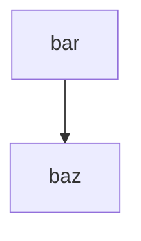

# Introduction to poreFlow

poreFlow is a Python package designed for the analysis of nanopore sequencing data, specifically tailored for handling data from both Oxford Nanopore Technologies (ONT) MinION and custom utube device in the Cees Dekker lab setups. It provides a formalized data structure inspired by MNE, modular processing functions, and interactive GUIs for event viewing and manual segmentation.

## The Core API

The core of poreFlow is built on top of `pandas.DataFrame`, extending it with metadata and methods specific to nanopore signal analysis.

### Raw Data Handling

Test



Raw signals are typically handled by the `RawDataFrame`. You can load data from a LabView .dat file easily:

```python
import poreflow as pf

# Load data from a LabView file
raw = pf.RawDataFrame.from_labview("measurement.dat", sfreq=5000)

# Plot the raw signal
raw.plot()
```

### Event Detection

Once raw data is loaded, you can detect translocation events:

```python
# Define ranges for open state and voltage for event detection
open_state_range = (80, 120)  # Current in pA
voltage_range = (160, 200)   # Voltage in mV

# Detect events
events = raw.find_events(open_state_range, voltage_range)

# Visualize raw data with detected events highlighted
raw.plot_with_events(events)
```

The result of `find_events` is an `EventsDataFrame`, which contains metadata about each detected event (start/end indices, times, etc.).

### Step Finding

Individual events can be analyzed to find discrete steps in the current signal, which often correspond to molecular transitions:

```python
# Assuming you have an EventDataFrame 'event'
steps = event.find_steps(sensitivity=1.0, min_level_length=2)

# steps is a StepsDataFrame containing info about each level
print(steps.head())
```

### Working with ONT Data

For Oxford Nanopore data (e.g., .fast5 files), use the `pf.File` interface:

```python
with pf.File("measurement.fast5", mode="r") as f:
    # Get raw data from a specific channel
    raw = f.get_raw(channel=1)
    
    # Get events if they are already stored in the file
    events = f.get_events(channel=1)
```

### Datasets

For larger scale analysis, `EventDataset` and `TablesDataset` provide convenient ways to iterate over many events:

```python
from poreflow.dataset import EventDataset

dataset = EventDataset("path/to/reads_dir")
for event, label in dataset:
    # Process individual pf.Event objects
    print(event.duration)
```

## The Interactive Dashboard

poreFlow includes a Dash-based dashboard for interactive data exploration and manual event labeling.

### Starting the Dashboard

You can launch the dashboard from a script or interactive session:

```python
from poreflow.dashboards.app import run_app

# Start the app (defaults to localhost:8050)
run_app(initial_path="path/to/your/data")
```

### Dashboard Features

- **File Manager**: Navigate your filesystem and select data files or directories for analysis.
- **Event Viewer/Labeler**: Visualize individual events, inspect signal features, and manually assign labels or segments.

## Workflow Summary

A typical poreFlow workflow involves:
1. **Loading**: Read data using `RawDataFrame.from_labview` or `pf.File`.
2. **Preprocessing**: Filter signals and detect the open state.
3. **Detection**: Identify translocation events using `find_events`.
4. **Feature Extraction**: Extract metrics like mean current, dwell time, or use changepoint detection.
5. **Classification**: Predict sequences or classify events based on extracted features.
6. **Curation**: Use the Dashboard to manually verify and label events.
