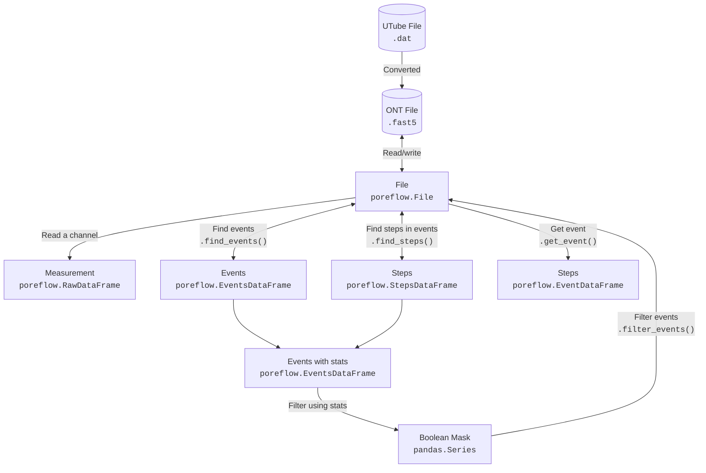

## Overview

This section describes the typical poreFlow workflow 

```mermaid
graph TD;
    A@{ shape: cyl, label: "ONT File<br><tt>.fast5</tt>"}<-->|Read/write|D[File<br><tt>poreflow.File</tt>]
    C@{ shape: cyl, label: "UTube File<br><tt>.dat</tt>"}-->|Converted|A
    D-->|Read a channel|B[Measurement<br><tt>poreflow.RawDataFrame</tt>]
    D<-->|"Find events<br><tt>.find_events()</tt>"|E[Events<br><tt>poreflow.EventsDataFrame</tt>]
%%    E-->|Saved|D
%%    D-->|"Get events<br><tt>.get_events()</tt>"|Ex
    D<-->|"Find steps in events<br><tt>.find_steps()</tt>"|G[Steps<br><tt>poreflow.StepsDataFrame</tt>]
%%    G-->|Saved|D
    E-->F[Events with stats<br><tt>poreflow.EventsDataFrame</tt>]
    G-->F
    F-->|Filter using stats|H["Boolean Mask<br><tt>pandas.Series</tt>"]
    H-->|"Filter events<br><tt>.filter_events()</tt>"|D
    D-->|"Get event<br><tt>.get_event()</tt>"|I[Steps<br><tt>poreflow.EventDataFrame</tt>]
```

