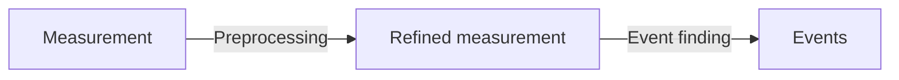
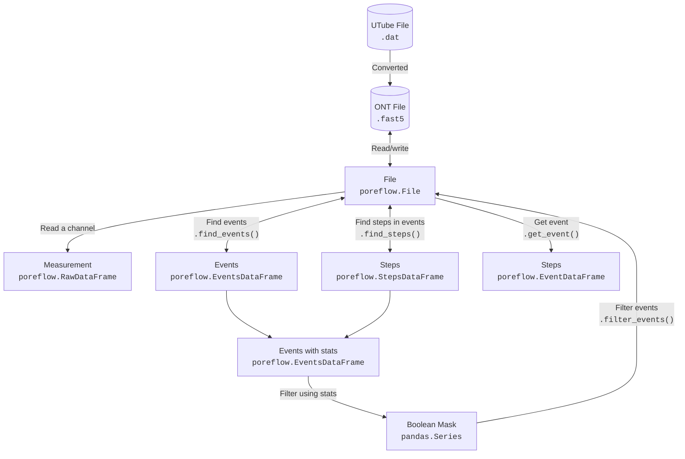

## I-V curve analysis

An example [Jupyter notebook file](https://gitlab.tudelft.nl/xiuqichen/poreFlow/-/blob/main/notebooks/IV_curve.ipynb?ref_type=heads) is provided for processing I-V curve measurement of a nanopore.

Once the poreFlow python env is configured properly, download this ipynb file to load the data file (.dat) for processing. 

## Sequencing analysis

For processing sequencing measurement data files (.fast5 or .dat), an example [Jupyter notebook file](https://gitlab.tudelft.nl/xiuqichen/poreFlow/-/blob/main/notebooks/ONT_processing.ipynb?ref_type=heads) is developed.

<!-- more details and usage options need to be provided here. Comments are included in HTML -->

A single [config file](https://gitlab.tudelft.nl/xiuqichen/poreFlow/-/blob/main/notebooks/parameters.toml?ref_type=heads) is used to aggregate all parameters related to the measurement, such as file name, event finding parameters, and filtering parameters.

## A typical nanopore sequencing workflow

## poreFlow

