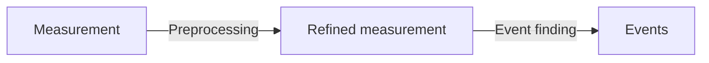
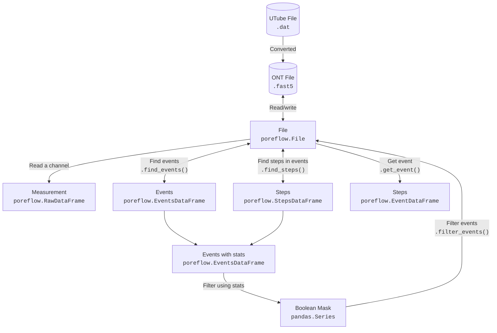

## I-V curve analysis

An example [Jupyter notebook](https://gitlab.tudelft.nl/xiuqichen/poreFlow/-/blob/main/notebooks/IV_curve.ipynb?ref_type=heads) is provided for processing I-V curve measurements of a nanopore.

Once the poreFlow Python environment is configured, download this notebook and load your data file (.dat) to begin processing.

## Sequencing analysis

For processing sequencing data files (.fast5 or .dat), an example [Jupyter notebook](https://gitlab.tudelft.nl/xiuqichen/poreFlow/-/blob/main/notebooks/ONT_processing.ipynb?ref_type=heads) is available.

<!-- more details and usage options need to be provided here. Comments are included in HTML -->

A single [config file](https://gitlab.tudelft.nl/xiuqichen/poreFlow/-/blob/main/notebooks/parameters.toml?ref_type=heads) centralizes all measurement parameters, including the file name, event-finding settings, and filtering criteria.

 
 
 
 
 
 
 

## A typical nanopore sequencing workflow

## poreFlow

