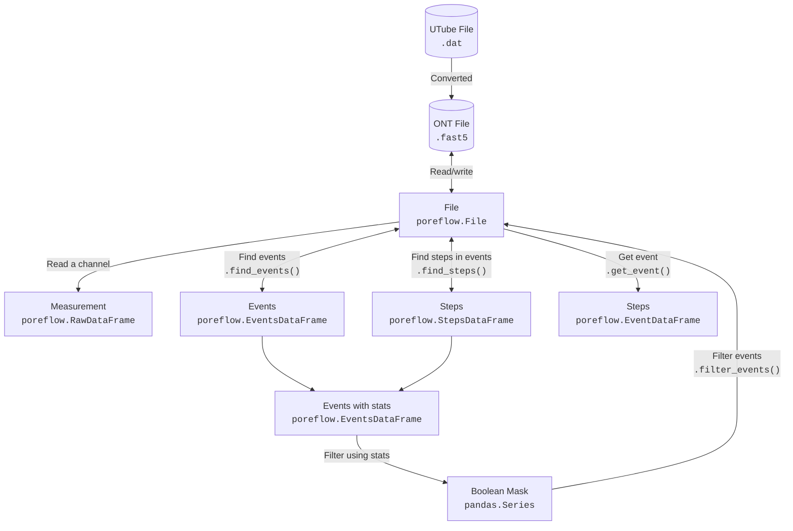

## Sequencing analysis

For processing the `.fast5` or `.dat` raw data files, check out the prepared jupyter notebook: [Processing script][] 
([:lucide-download: Download][Script download]).

A single [config file](https://gitlab.tudelft.nl/xiuqichen/poreFlow/-/blob/main/notebooks/parameters.toml?ref_type=heads) centralizes all measurement parameters, including the file name, event-finding settings, and filtering criteria.


## I-V curve analysis

For processing the I-V curve measurement, check out [IV curve script] ([:lucide-download: Download][IV script download]).

Once the poreFlow Python environment is configured, download this notebook and load your data file (.dat) to begin processing.


## Measurement inspection and processing in poreFlow Dashboard

Start the poreFlow dashboard in a terminal by simply running:

```shell
poreflow
```

A new tab will automatically appear in your browser.

<br>
<br>
<br>
<br>
<br>
<br>
<br>


## A typical nanopore sequencing workflow


## poreFlow




[Processing script]: https://gitlab.tudelft.nl/xiuqichen/poreFlow/-/blob/main/notebooks/ONT_processing.ipynb?ref_type=heads
[Script download]: https://gitlab.tudelft.nl/xiuqichen/poreFlow/-/raw/main/notebooks/ONT_processing.ipynb?ref_type=heads&inline=false
[IV curve script]: https://gitlab.tudelft.nl/xiuqichen/poreFlow/-/blob/main/notebooks/IV_curve.ipynb?ref_type=heads
[IV script download]: https://gitlab.tudelft.nl/xiuqichen/poreFlow/-/raw/main/notebooks/IV_curve.ipynb?ref_type=heads&inline=false
