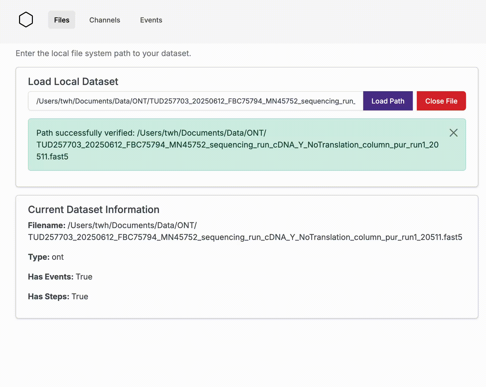
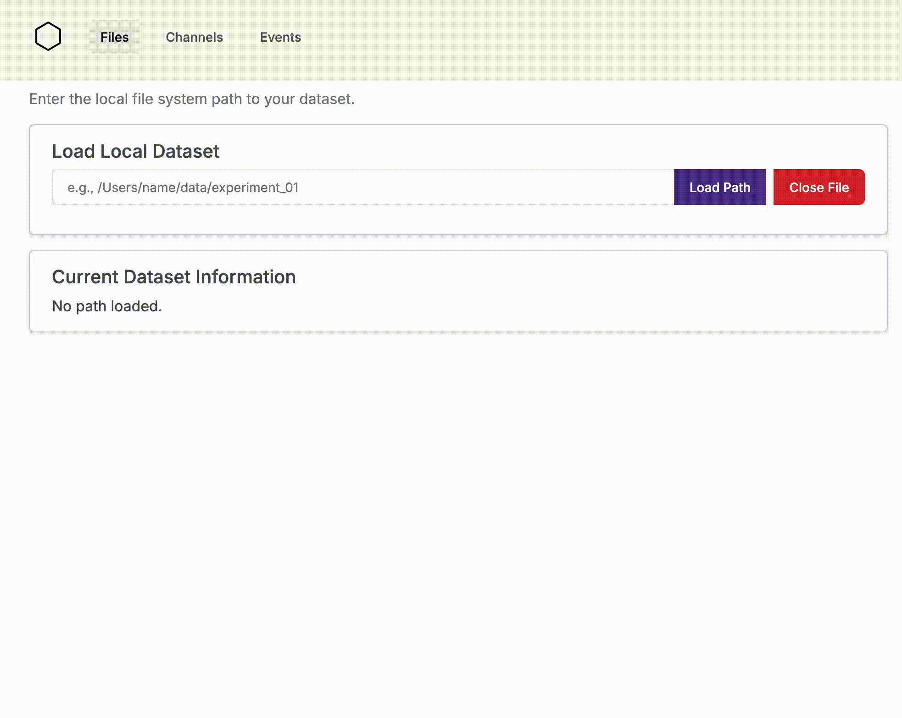
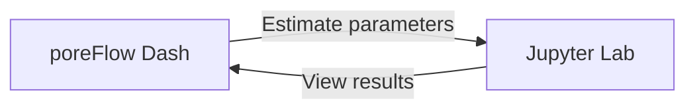

# Version 0.3.4

Release date: March 9, 2026

## Highlights

### Overall
This release is the start of many updates to the poreFlow Dashboard. In this release, the dashboard has been 
restructured into a separate module, `poreflow_dash`, installed alongside poreFlow. 

### Layout
The sidebar in the dashboard has been removed and a tab-based layout is used instead. This gives more horizontal space for plots. 

<figure markdown="span">
  
<figcaption>New tab-based layout</figcaption>
</figure>

### Plotting improvements
Changes have been made in the plotting back-end which allow for fast viewing of events/steps in the viewers 
(also without resetting the axes). In addition, the channel viewer now features clearer downsampling settings. 

<figure markdown="span">
  
<figcaption>Events shown in the Channel Viewer can be clicked and are then opened in the Event Viewer. 
Labels set in the Event Viewer are also visible in the channel. Downsampling settings for the Events and Channel 
data can be set independently. </figcaption>
</figure>

### I/O improvements

The file loader in the dashboard supports double quotes, meaning that Windows users can paste in their paths directly.
<figure markdown="span">
  
<figcaption>No more deleting quotes.</figcaption>
</figure>

In addition, there is now a button to close the file in the Dashboard. This makes it easy to switch back and forth 
between the Dashboard and a Jupyter Notebook.
<figure markdown="span">
  
<figcaption>Closing a file.</figcaption>
</figure>

A potential workflow combining Jupyter Lab and poreFlow could be:

## Changelog

### Dashboard & UI Improvements
- Refactored dashboard into separate `poreflow_dash` module 
- Switched to tab-based navigation
- Created clickable events in channel viewer that switch to event viewer
- Added URL-based event loading capability
- Set store as single source of truth for navigation persistence
- Improved channel and event navigation
- Added filename display at top of pages
- Updated button styles and cleaned up old styles
- Generalized Y-axis scaling settings
- Moved downsample settings above channel viewer
- Improved axis scaling and show/hide performance with patching
- Added support for path entering with double quotes for Windows users

### IV Curve Features
- Added IV curve visualization in time series
- Implemented IV curve export functionality
- Added voltage segments for analysis
- Pooled raw data for I-V calculations
- Improved IV curve visual representation

### Performance & Code Quality
- Cleaned up dashboard file management code
- Improved local dashboard server and CLI functionality
- Refactored plot update callbacks
- Reformatted and linted codebase
- Refactored dashboard names for consistency
- Put config and constants as top-level dashboard imports

### Bug Fixes
- Fixed C++ error in step detection

### Documentation
- Updated AGENTS.md with new features and usage information

## Authors
Thijn Hoekstra and Xiuqi Chen, see [Authors].

[Authors]: ./../authors