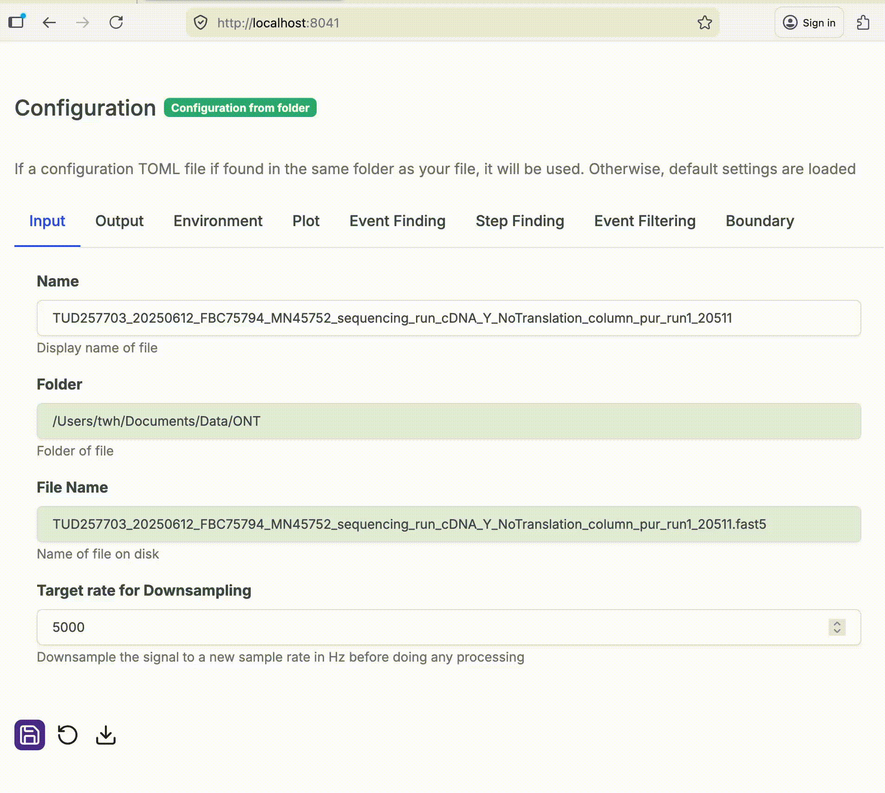

# Version 0.4.0

Release date: March 31, 2026

This release introduces major architectural changes to improve performance, flexibility, and usability. 
Key changes include the introduction of "Annotation" files and an upgraded dashboard. 

## Highlights

### Annotations 

!!! info

    For a complete description of the annotations system, check out: [Annotations][].

Analysis results like events and steps are now stored in a separate file from raw data, allowing for more flexible 
data management and easier sharing of analysis results without raw data. Consider this example project:

```title="Project structure"
my-project/
 └── measurement.dat 
```

Then this `.dat` data file, can be opened using [poreflow.File][]:

```python linenums="1"
import poreflow as pf

with pf.File("measurement.dat") as f: # (1)!
    f.find_events() # (2)!
```

1.  A `.fast5` and annotation file is created automatically here.
2.  Analysis results, such as events, are automatically stored in the annotations file.

Processing results are stored in a separate file with the `annot.fast5` extension.

```title="Project structure (after opening)"
my-project/
 ├── measurement.dat    
 ├── measurement.fast5    
 └── measurement.annot.fast5  <-- Analysis results (read-write)
```

This new system is fully backward compatible with poreFlow 0.3.X, as annotation opening is managed under the 
hood by [poreflow.File][]. As a result, no changes in processing scripts are needed. Note that the annotations 
system has many advantages for most users, to learn more, check out the 
[Annotations][] feature page.

### Filtering improvements

!!! info

    For a complete description of the annotations system, check out: [Filtering][].

Changes have been made to the downsampling and filtering workflows. poreFlow DataFrames can be downsampled and 
filtered at any time using their methods:

```python linenums="1"
with pf.File("utube_measurement.dat") as f:
    raw = f.get_raw()

raw = raw.downsample(5000).apply_filter(1000) # (1)!

print(f"Original sample rate: {raw.sfreq_original} Hz")
print(f"Downsampled to:       {raw.sfreq} Hz, ")
print(f"Filtered to:          {raw.filter_cutoff} Hz, ")
```

1. First downsample to 5 kHz using decimation, then filter with a 4^th^-order Bessel filter

<div class="result" markdown>
```
Original sample rate: 50000.0 Hz
Downsampled to:       5000.0 Hz, 
Filtered to:          1000 Hz,
```
</div>

This new system is *not* backward compatible with poreFlow 0.3.X, so minor changes in processing scripts are needed. 
To learn more about filtering and downsampling, check out the [Filtering][] feature page.

### Dashboard Improvements
The dashboard has seen UI refinements and better handling of configuration files. 


#### Introducing configurations

To keep all the configuration settings in one place, we have created a `poreflow.toml` file, which stores 
all the settings for the poreFlow Dashboard. Besides the dashboard, this TOML is also useful in 
Python scripts for building central configurations scheme.


After loading a file, the Dashboard now shows richer information on the dataset, including the sample rate, 
number of events, and number of steps. 

When loading a file, poreFlow searches the folder of the data file for a configuration file called `poreflow.toml` and 
loads this configuration. This configuration for the session is shown below the file input. 

The "Default" badge indicates that no `poreflow.toml` in the same folder as the loaded data file. If a config file was 
found, this will show "Configuration from folder".

The configuration can be edited, and settings are used in the rest of the dashboard. 
Each page also has a settings button (:lucide-settings:) which opens a settings window. 
This window shows the sections of the configuration that are useful for that page.

For an example of a default `poreflow.toml`, check out the [Configurations] feature page.

#### Saving a configuration


By clicking the save button (:lucide-save:), the configuration is saved to disk next to the file:

```title="Project structure"
my-project/
 ├── measurement.fast5    
 ├── measurement.annot.fast5    
 └── poreflow.toml           <--- Saved here
```

!!! info "Coming soon..."
    
    We are working on a feature you can manually override which `.toml` file poreFlow Dashboard uses
    as a configuration (so you can have multiple configurations). Stay tuned!


#### Downloading a configuration



A configuration can also be saved directly to the downloads folder using the download button (:lucide-download:).


#### Event finding


Events can now be detected directly in poreFlow Dashboard. When viewing a channel on the "Channels" page click :lucide-eye:/:lucide-eye-closed:
to show/hide events. Events are shown in grey by default if available.

To find events, click :lucide-search:, which starts the events finder using the configuration in the "Event Detection" 
section of the configuration. 

To remove events from the current channel whilst preserving other events, click :lucide-scissors:. To remove all 
events, click :lucide-trash:.

!!! tip "Tooltips"
    Most features and settings now have a tooltip which is shown when hovering over that feature.

!!! info "Coming soon..."
    
    Event filtering and step detection in poreFlow dash are coming soon. Stay tuned!

## Migration Guide

No migration is needed for the annotation system. However, changes may be needed in processing scripts due to changes in the filtering/downsampling methods. 
This mainly concerns old scripts with downsampling in `poreflow.File.get_raw()` or `poreflow.File.get_event()`, for 
example:

```python linenums="1" title="Previous versions of poreFlow (0.3.X)"
with pf.File("utube_measurement.dat") as f:
    raw = f.get_raw(downsample=5000)

raw = raw.downsample(5000)
```

Change such uses to the following:

```python linenums="1" title="Updated code for this version of poreFlow (0.4.0)"
with pf.File("utube_measurement.dat") as f:
    raw = f.get_raw().downsample(5000)
```

## Changelog

### Architecture & Core Changes
- Separated annotations into their own file for better data management
- Refactored `File` class into `DataFile` (raw data) and `File` (with annotations)
- Added pointer system for efficient data access in `DataFile`
- Improved parallel processing for event and step detection leveraging annotation system and pointers
- Improved downsampling and filtering API
- Added support for alternative annotation paths
- Event boundary trimming is now supports removing a different amount of time before and after detected events
- Event boundary trim now takes trim sizes in milliseconds rather than samples

### Dashboard & UI Improvements
- Refactored settings system with TOML configuration
- Added auto-scaling and better downsampling controls
- Improved UI for channel and event viewers
- Enhanced error handling and user feedback
- Added validation for configuration settings
- Improved layout and button styles

### Performance & Code Quality
- Optimized multiprocessing for different platforms (Windows/Linux)
- Removed need for file locking and I/O handling
- Enhanced downsampling with better handling of integer columns
- Added better exception handling for event detection
- Cleaned up and refactored tests for CI/CD

### Bug Fixes
- Fixed bug in event detection with `start_idx` handling
- Fixed issues with channel numbering in open state fit datasets
- Fixed downsampling issues with integer columns
- Fixed issue with removal of exclusion of samples with incorrect voltages from events in event detection
- Fixed configuration error handling in dashboard

### New Features
- Added IV curve visualization and export functionality
- Implemented voltage segments for analysis
- Added support for manual IV curve processing
- Enhanced event duration filtering in detection
- Added display of processing statistics in plots
- Improved handling of unavailable data in `poreflow.File`

### Documentation
- Updated AGENTS.md with new features and usage information
- Improved notebook examples

## Authors
Thijn Hoekstra and Xiuqi Chen, see [Authors].

[Annotations]: ../features/io/annotations.md
[Filtering]: ../features/filtering.md
[Configurations]: ../features/io/configurations.md
[Authors]: ./../authors
[F]: ../../reference/poreflow/#poreflow.File